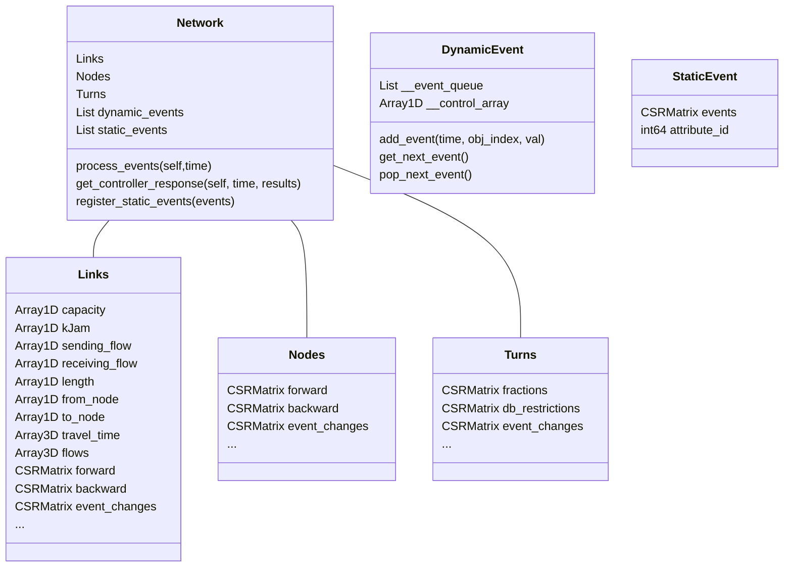

### Class Structure and Design Choices
Below you can see a schematic outlining the current implementation of the data structures that are used in the class 
definitions. CSRMatrices are used extensively to minimize access times to different node-, link-, or turn based 
attributes of variable size. For elaborations on how they are constructed consult the comments in the files.



We want to point out here the purpose and intention behind keeping track of DynamicEvent and StaticEvent objects 
that are associated with the Network. 
First, some background that serves as motivation: Throughout the day attributes that we, as modellers, associate with entities may vary. 

This can happen in two ways, (i) deterministically: Think about reductions in speed for roads in the vicinity of 
schools, lane reversals or different traffic signal plans for off peak hours. And (ii) dynamically if we have 
controllers in play that react to the network state __during__ the simulation.
This has some implications for the design of our data structures. We want to avoid storing large matrices with
attributes duplicated for different time intervals when we know that most of the time these attributes will most likely 
not change.
Therefore arrays are kept time independent, e.g. 1 dimensional and manipulated 
on-the-fly as we step through the different time slices within the computation. 
To address deterministic changes we maintain static_events in the network that are simply CSR matrices with 
f(time_slice, obj_id)=val with obj_id indicating the turn-, node- or link ids. 

Below is a possible design of what that could look like specifically. In time slice 1 the value of obj 4 is changed to $`A`$.
At time step 3 the value is changed to $`B`$, $`B`$ could very well be the value that was given before $`A`$ was set. 
The Network object stores a reference to the controlled array for each of the StaticEvent objects and updates them appropriately for each time step as we progress through the simulation in the
network loading.
The construction of the CSRMatrices for these StaticEvents can be done in pre-processing.

```math
\begin{array}{ccccccc}
&\text{id}&0&1&2&3&4\\
\text{time}\\
\\
  0&&0 & 0 & 0 & 0 & 0  \\
  1&&0 & 0 & 0 & 0 & A  \\
  2&&0 & 0 & 0 & 0 & 0  \\
  3&&0 & 0 & 0 & 0 & B  \\
  4&&0 & 0 & 0 & 0 & 0  \\
\end{array}  
```
The development for data structures that also allow generic control paradigms with a different
temporal granularity than LTM remains to be further investigated.
At this point it's not entirely clear how it would work, after implementing some control flavored
versions of LTM this'll be revisited. 
Nevertheless we will include a simple controller class which takes it's control actions in sync with the
Network loading because it is a straight forward extension of the dealing with the static events.