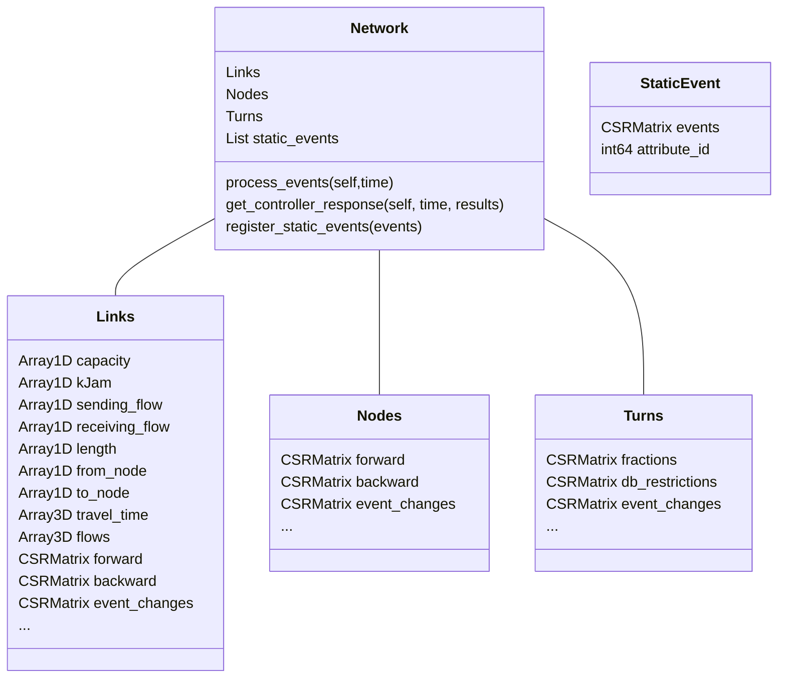

### Class Structure and Design Choices
Below you can see a schematic outlining the current implementation of the data structures that are used in the class 
definitions. CSRMatrices are used extensively to minimize access times to different node-, link-, or turn based 
attributes of variable size. For elaborations on how they are constructed consult the comments in the files.

The class structure above may not reflect the most recent state. The current architecture is meant to facilitate 
extensions, such as different network loading mechanisms, easily. Base line objects like Node, Links and Turns are
inherited from when conceiving new data structures for a specific network loading method. This is demonstrated in the jitclass
 for I-LTM, the setup file for I-LTM shows how the default objects can be replaced in the assignment object.
 Similar consideration will be made for the Route Choice objects as well, to decouple the implementation of route choice
  and network loading and allow swapping in different methods without rewriting the existing code base.
 

We want to point out here the purpose and intention behind keeping track of StaticEvent objects 
that are associated with the Network. 
First, some background that serves as motivation: Throughout the day attributes that we, as modellers, associate with entities may vary. 

This can happen in two ways, (i) deterministically: Think about reductions in speed for roads in the vicinity of 
schools, lane reversals or different traffic signal plans for off peak hours. And (ii) dynamically if we have 
controllers in play that react to the network state __during__ the simulation.
This has some implications for the design of our data structures. We want to avoid storing large matrices with
attributes duplicated for different time intervals when we know that most of the time these attributes will most likely 
not change.
Therefore arrays are kept time independent, e.g. 1 dimensional and manipulated 
on-the-fly as we step through the different time slices within the computation. 
To address deterministic changes we maintain static_events in the network that are simply CSR matrices with 
f(time_slice, obj_id)=val with obj_id indicating the turn-, node- or link ids. 

Below is a possible design of what that could look like specifically. In time slice 1 the value of obj 4 is changed to $`A`$.
At time step 3 the value is changed to $`B`$, $`B`$ could very well be the value that was given before $`A`$ was set. 
The Network object stores a reference to the controlled array for each of the StaticEvent objects and updates them appropriately for each time step as we progress through the simulation in the
network loading.
The construction of the CSRMatrices for these StaticEvents can be done in pre-processing.

A controller can exploit this structure by making changes in sync with the LTM time steps and registering changes 
(control actions) for the next time step. A smaller control granularity can be attained by lowering the time step
,at the expense of computing time. (documentation and implementation to be extended)

```math
\begin{array}{ccccccc}
&\text{id}&0&1&2&3&4\\
\text{time}\\
\\
  0&&0 & 0 & 0 & 0 & 0  \\
  1&&0 & 0 & 0 & 0 & A  \\
  2&&0 & 0 & 0 & 0 & 0  \\
  3&&0 & 0 & 0 & 0 & B  \\
  4&&0 & 0 & 0 & 0 & 0  \\
\end{array}  
```
The development for data structures that also allow generic control paradigms with a different
temporal granularity than LTM remains to be further investigated.
At this point it's not entirely clear how it would work. We hope that, after implementing some control flavored
versions of LTM, this can be revisited. 
Nevertheless, we will include a simple controller class which takes its control actions in sync with the
network loading because it is a straight forward extension of the dealing with the static events.
###Node model data structures
The node model needs as its input the global sending and receiving flows of the node's incoming and outgoing links,
 global turning fractions for the different turns, and the capacity of the incoming links. With global we mean 
 homogeneous flow that is not destination based. Turning fractions and Link characteristics are sorted by their 
 respective Turn- and Link IDs [^1]. Internally, the node model needs to be able to associate with each Turn its incoming 
 and outgoing Link and connected characteristics (typically capacity). It's undesirable to pass on the whole mappings between
 Turns and Links to the node model, we address this problem by creating a new mapping that exploits the stable 
 topological order of the link IDs, see figure below.
  
 
 *On the right hand side of the figure you see an input vector of the 
 node model, here sending flow. This is gathered from a larger array that contains the homogeneous sending flows for all
  links for one time step. The respective indexes are given through the sparse in_link and out_link structures for the 
  nodes, on the left hand side you see the solution to the mapping issue described in the section above. We store a 
  sparse matrix which gives the index of the in_link as it is received by the node model. This allows us to connect 
  with each turn its in_link and out_link attributes without repeatedly querying our global mappings. For example we know 
  that Turn 1 & 2 (starting from 0) share the same incoming link as they point to the same index in the sending flow 
  array. Note that an equivalent sparse matrix is required for the out links to map 
  the receiving flows, see ILTMNode class.*

 
 
 [^1]: This may not always be the case with sparse matrices where entities like links are often associate with more than
 one topological ordering. E.g. we could keep a FromNode x ToNode matrix with the respective link IDs as values or a 
 FromNode x Link matrix with the toNode IDs as values. Each option yields a different topological order when retrieving
 the values/NNZs for each FromNode.
 Choices are made based on what seems efficient for the
 use of the data structure inside the algorithms.
 
 ### on Memory layout
 To understand the decisions made here do check the numpy documentation: 
 https://numpy.org/doc/stable/reference/internals.html#multidimensional-array-indexing-order-issues or 
 this excellent article: https://eli.thegreenplace.net/2015/memory-layout-of-multi-dimensional-arrays .
 
 Basically, we can choose between storing our matrices 2- and 3 D matrices in row- (numpy & C default) or column
 major orders (Matlab, Fortran) which has implications for the access speed to different dimensions.
 For C ordered arrays the memory strides are always largest for the first dimension and smallest for the last.
 For F ordered arrays the inverse is true. We (mostly) stick here with with F order to make the transition from Matlab easier.
 Deviations are noted.
 At times we may use numpy's transpose() to get a view which is striding in the opposing Order. Note that this does 
 *not* imply copying the array. It simply tells numpy to stride over the memory in a different manner.
 You can verify this by analyzing .flags and .strides on a given array and it's transpose.
 We'll denote transposed arrays by adding a '_T' at the end of the variable name. 
 We need to care about this because it's crucial that we loop over the array in a way that is in line with the way that 
 underlying data lies in memory.
 
 ###What's still coming?
 do check trello 
 https://trello.com/invite/b/JJe3F5H3/84248383af0033e19119df8fa817da65/dta-implementation
 

 