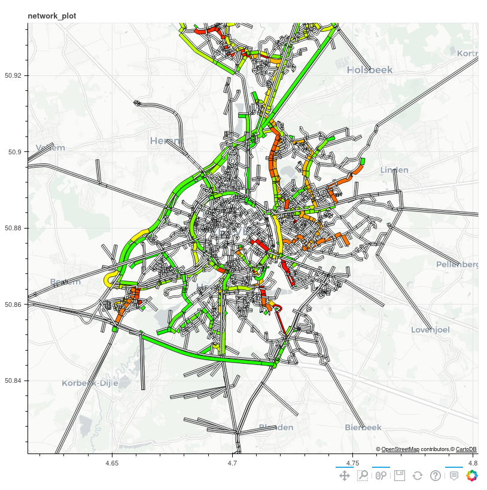
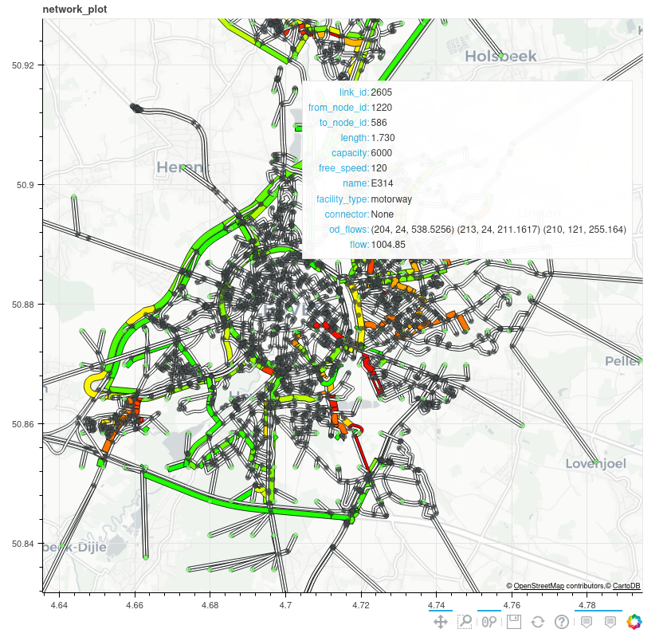

# Statement of need

Macroscopic Traffic Models, based on the idea that traffic in a city can be modelled much like a fluid, have been used to guide transport policy and mitigate congestion for more than 50 years.
They find a fixed point in the interaction between two phenomena: (i) drivers make routing decisions based on the observed travel times and try to minimize their experienced travel times; (ii) route flows determine the congestion pattern and affect travel times. This fixed point may be further generalized to include choice of departure time, transport mode, activity location and other behavioural dimensions.
Building useful transport models is a balancing act between capturing realistic behaviour and managing the computational complexity of models that are routinely used to simulate the journeys of thousands of cars simultaneously.
Authors have created a variety of flavours of these models that emphasize preferences for one or another aspect of realism at the cost of others, see @bliemer_genetics_2017 for a recent overview and classification.

Independent of the algorithm used, there are commonalities between the software that is used to model car traffic macroscopically. Namely, road network- and travel demand processing, representation of the same as efficient computational entities and the visualization and processing of results.
This is part of what `dyntapy` provides. Additionally, a selection of static and dynamic traffic assignment algorithms have been implemented and can be used by researchers in transport modelling to conduct studies in which the interaction with an assignment model and/or the accurate modelling of congestion is of concern. Commercial offerings are often expensive and do not allow one to make adjustments to the core of the algorithms. `dyntapy` is a useful starting point for studies which require such manipulation.

It also lends itself to educational use and has already been used in traffic engineering courses at KU Leuven.

# Summary

`dyntapy` is a python package for modelling car traffic macroscopically. It provides a few key features to researchers in traffic modelling:
(i) extraction and formatting of road network graphs from OpenStreetMap using OSMnx [@boeing_osmnx_2017], following the GMNS standard (General Modeling Network Specification: https://github.com/zephyr-data-specs/GMNS); (ii) parsers for road network and travel demand information; (iii) fast shortest path computations; (iv) both static and dynamic traffic assignment algorithms; (v) selected link analysis^[as of now merely for some static assignments]; and (vi) flexible visualization tools.

The toolkit is designed to be extendable. The provided object-oriented specification of the road network, travel demand and results are generic and allow for other assignment algorithms to be added without much additional effort.
Because there is a shared definition of the modelling results, visualization tools can be used without modification for different algorithms.

`dyntapy` utilizes Networkx [@SciPyProceedings_11] for managing the road network graph. Numpy [@harris_array_2020] is used for fast array calculations and Numba [@lam_numba_2015] to accelerate computations that involve graph traversal via sparse matrices.

Bokeh^[https://bokeh.org] powers the flexible visualization of static and dynamic^[Examples on the visualization of dynamic attributes can be found in the repository.] assignment results, see \autoref{fig:tap} and \autoref{fig:link} below.

We provide two algorithms for solving the deterministic Traffic Assignment Problem, namely, Dial's Algorithm B [@dial_path-based_2006] and the Method of Successive Averages. For solving the stochastic uncongested Traffic Assignment Problem, we use Dial's Algorithm [@dial_probabilistic_1971].
For the deterministic Dynamic Assignment Problem we utilize the iterative link transmission model [@himpe_efficient_2016], as dynamic network loading component, an iterative route choice component introduced in @himpe_integrated_2016 based on quasi-reduced projection [@mahutComparisonAssignmentMethods2008] and travel time calculations of the MLI type as introduced in @long_discretised_2011. 

We welcome contributions by other authors to add to this selection.
In the short term the stochastic Dynamic Traffic Assignment model that was introduced in @verstraete_consistent_2021 will be added to the list of available algorithms.

`dyntapy` is being used for scenario analysis as part of DUET [@raes_duet_2021], a platform for digital twins of cities in which policy makers can explore the impact of road network changes on congestion and emissions. 

For usage examples and tutorials we refer the reader to the [dyntapy documentation](https://dyntapy.readthedocs.io).

# Outlook and use cases

In its current state `dyntapy` is most interesting for assignment researchers, transport modellers and students that want to get hands-on experiments with assignments. 

Macro- and mesoscopic commercial modelling software offer some functionalities that are beyond what `dyntapy` provides and make it less suitable for studies in which realism is of chief concern.  Namely, (i) support for specifying intersections in more details and calculating delays based on signals and priorities; (ii) calibration routines for supply and demand for both static and dynamic assignments^[note that in dynamic assignment, calibration remains an open research question]. 

Support for intersection data both in the parser and as constraints in the models is a long term goal for dyntapy, however currently data for intersections is not widely available.
OpenStreetMap's encoding of intersections is not suitable for use in traffic models, partly because of its ambiguity, but also because it does not allow to specify signal timings.
GMNS fills this gap, however the amount of datasets available in this standard is still very limited.

Regarding (ii): there are currently no plans to add calibration to dyntapy. Intersections are the main causes of queuing in traffic models. Before we can hope to calibrate models we need to have more certainty about the specification of intersections.

# Acknowledgements

This research has been funded by DUET - Digital Urban European Twins as part of the Horizon 2020 funding program (Grant ID 870607). 
Many thanks to Jeroen Verstraete and Willem Himpe for their feedback on some of the design decisions that have been made in `dyntapy`.

# References
